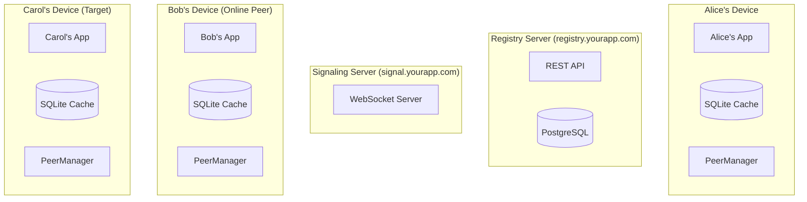

# P2P Messaging Control Flow Diagram
Complete System Architecture & Flow



## Detailed Control Flow: Alice Messaging Carol

```
┌─────────────────────────────────────────────────────────────────────────────┐
│                         ALICE WANTS TO MESSAGE CAROL                        │
└─────────────────────────────────────────────────────────────────────────────┘

ALICE'S DEVICE                  BOB'S DEVICE           CAROL'S DEVICE         REGISTRY/SIGNAL
     │                               │                        │                      │
     │                               │                        │                      │
═════╪═══════════════════════════════╪════════════════════════╪══════════════════════╪═════
     │   STEP 1: CHECK LOCAL         │                        │                      │
═════╪═══════════════════════════════╪════════════════════════╪══════════════════════╪═════
     │                               │                        │                      │
     ├──┐                            │                        │                      │
     │  │ Check ActiveConnections    │                        │                      │
     │<─┘ Map<userId, RTCConnection> │                        │                      │
     │    ❌ Not Found               │                        │                      │
     │                               │                        │                      │
     ├──┐                            │                        │                      │
     │  │ Check SQLite Cache         │                        │                      │
     │<─┘ "SELECT * FROM peer_routes │                        │                      │
     │     WHERE user_id='carol'"    │                        │                      │
     │    ❌ No recent route         │                        │                      │
     │                               │                        │                      │
═════╪═══════════════════════════════╪════════════════════════╪══════════════════════╪═════
     │   STEP 2: P2P DISCOVERY       │                        │                      │
═════╪═══════════════════════════════╪════════════════════════╪══════════════════════╪═════
     │                               │                        │                      │
     │  DataChannel Message          │                        │                      │
     ├──────────────────────────────>│                        │                      │
     │  {                            │                        │                      │
     │    type: "PEER_QUERY",        │                        │                      │
     │    lookingFor: "carol_id",    │                        │                      │
     │    requestId: "req_123"       │                        │                      │
     │  }                            │                        │                      │
     │                               │                        │                      │
     │                               ├──┐                     │                      │
     │                               │  │ Bob checks his      │                      │
     │                               │<─┘ connections         │                      │
     │                               │    ✓ Carol connected   │                      │
     │                               │                        │                      │
     │  DataChannel Response         │                        │                      │
     │<──────────────────────────────┤                        │                      │
     │  {                            │                        │                      │
     │    type: "PEER_FOUND",        │                        │                      │
     │    userId: "carol_id",        │                        │                      │
     │    signalAddr: "wss://signal. │                        │                      │
     │     yourapp.com/carol_dev_456"│                        │                      │
     │    canRelay: true             │                        │                      │
     │  }                            │                        │                      │
     │                               │                        │                      │
═════╪═══════════════════════════════╪════════════════════════╪══════════════════════╪═════
     │   STEP 3: WEBRTC CONNECTION   │                        │                      │
═════╪═══════════════════════════════╪════════════════════════╪══════════════════════╪═════
     │                               │                        │                      │
     │  Connect to Signal Server     │                        │                      │
     ├────────────────────────────────────────────────────────────────────────────>│
     │  WSS://signal.yourapp.com/    │                        │                      │
     │  alice_device_123             │                        │                      │
     │                               │                        │                      │
     │  Create RTCPeerConnection     │                        │                      │
     ├──┐                            │                        │                      │
     │  │ pc = new RTCPeerConnection │                        │                      │
     │<─┘ dataChannel.create("msg")  │                        │                      │
     │                               │                        │                      │
     │  Send Offer via Signal        │                        │                      │
     ├────────────────────────────────────────────────────────────────────────────>│
     │  {                            │                        │                      │
     │    type: "OFFER",             │                        │                      │
     │    from: "alice_device_123",  │                        │                      │
     │    to: "carol_device_456",    │                        │                      │
     │    sdp: "..." }               │                        │                      │
     │                               │                        │                      │
     │                               │                        │   Signal Relay      │
     │                               │                        │<────────────────────┤
     │                               │                        │   Forward Offer     │
     │                               │                        │                     │
     │                               │                        ├──┐                  │
     │                               │                        │  │ Process Offer    │
     │                               │                        │<─┘ Create Answer    │
     │                               │                        │                     │
     │                               │                        │   Send Answer       │
     │                               │                        ├────────────────────>│
     │                               │                        │                     │
     │  Receive Answer               │                        │                     │
     │<───────────────────────────────────────────────────────────────────────────┤
     │                               │                        │                     │
     │  ICE Candidates Exchange      │                        │                     │
     │<─────────────────────────────────────────────────────>│                     │
     │  (Multiple messages via       │                        │                     │
     │   signal server)              │                        │                     │
     │                               │                        │                     │
     │  P2P Connection Established   │                        │                     │
     │<═══════════════════════════════════════════════════════>                     │
     │  Direct DataChannel           │                        │                     │
     │                               │                        │                     │
═════╪═══════════════════════════════╪════════════════════════╪══════════════════════╪═════
     │   STEP 4: SEND MESSAGE        │                        │                      │
═════╪═══════════════════════════════╪════════════════════════╪══════════════════════╪═════
     │                               │                        │                      │
     │  DataChannel.send()           │                        │                      │
     ├───────────────────────────────────────────────────────>│                      │
     │  {                            │                        │                      │
     │    type: "CHAT_MESSAGE",      │                        │                      │
     │    id: "msg_789",             │                        │                      │
     │    content: "Hello Carol!",   │                        │                      │
     │    timestamp: 1642684800,     │                        │                      │
     │    signature: "ed25519:..."   │                        │                      │
     │  }                            │                        │                      │
     │                               │                        │                      │
     │  Receive ACK                  │                        │                      │
     │<───────────────────────────────────────────────────────┤                      │
     │  {type: "ACK", msgId: "789"}  │                        │                      │
     │                               │                        │                      │
     ├──┐                            │                        │                      │
     │  │ Update UI: ✓ Delivered     │                        │                      │
     │<─┘                            │                        │                      │
     │                               │                        │                      │
```

## Fallback Flow: When P2P Discovery Fails

```
ALICE'S DEVICE                                           REGISTRY SERVER
     │                                                          │
═════╪══════════════════════════════════════════════════════════╪═════
     │   STEP 5: REGISTRY FALLBACK (Last Resort)               │
═════╪══════════════════════════════════════════════════════════╪═════
     │                                                          │
     │  GET /network/{networkId}/peer/carol                    │
     ├─────────────────────────────────────────────────────────>│
     │  Host: registry.yourapp.com                             │
     │  Auth: Bearer {token}                                   │
     │                                                          │
     │                                                          ├──┐
     │                                                          │  │ Query DB
     │                                                          │<─┘
     │                                                          │
     │  Response: 200 OK                                       │
     │<─────────────────────────────────────────────────────────┤
     │  {                                                       │
     │    "online": false,                                     │
     │    "lastSeen": "2024-01-20T08:00:00Z",                  │
     │    "lastCoordinators": [                                │
     │      "bob_device_123",                                  │
     │      "eve_device_789"                                   │
     │    ]                                                    │
     │  }                                                       │
     │                                                          │
     ├──┐                                                       │
     │  │ Try coordinators or                                  │
     │  │ switch to Store & Forward                            │
     │<─┘                                                       │
     │                                                          │
```

## API Endpoints & URLs

### Registry Server APIs

**Base URL:** `https://registry.yourapp.com`

**Authentication:** Bearer token in header

**Endpoints:**
- `GET  /network/{networkId}/active-peers`     # Get all active peers
- `POST /network/{networkId}/announce`         # Announce presence
- `GET  /network/{networkId}/peer/{userId}`    # Get specific peer (last resort)
- `POST /coordinator/heartbeat`                # Coordinator status update

### Signaling WebSocket

**URL:** `wss://signal.yourapp.com/{deviceId}`

**Message Types:**
- `OFFER`: WebRTC offer SDP
- `ANSWER`: WebRTC answer SDP  
- `ICE_CANDIDATE`: ICE candidate info
- `RELAY_REQUEST`: Request peer to relay

### P2P DataChannel Protocol

Direct peer-to-peer messages (no server):

**Message Types:**
- `PEER_QUERY`: Looking for specific user
- `PEER_FOUND`: Response with peer info
- `NETWORK_STATE`: Periodic network status
- `CHAT_MESSAGE`: Actual user message
- `FILE_CHUNK`: File transfer data
- `STORE_MESSAGE`: Store for offline peer

## Connection Priority & Timing

```
┌──────────────────────────────────────────────────────────┐
│                  Discovery Method Timeline                │
├──────────────────────────────────────────────────────────┤
│                                                           │
│  0ms    Check local connections map                      │
│  ├──────┤                                                │
│                                                           │
│  5ms    Query SQLite cache                               │
│  ├─┤                                                      │
│                                                           │
│  50ms   Ask connected peers (P2P)          │
│  ├──────────────────┤                                    │
│                                                           │
│  200ms  Try cached coordinators                          │
│  ├──────────────────────────┤                           │
│                                                           │
│  500ms  Registry API call (last resort)                  │
│  ├───────────────────────────────────────┤              │
│                                                           │
│  1000ms Store & Forward fallback                         │
│  ├────────────────────────────────────────────────────┤  │
│                                                           │
└──────────────────────────────────────────────────────────┘
```

## State Management

**Connection States:**
```
┌────────────┐      ┌────────────┐      ┌────────────┐
│DISCONNECTED│ ───> │DISCOVERING │ ───> │ SIGNALING  │
└────────────┘      └────────────┘      └────────────┘
                           │                    │
                           ↓                    ↓
                    ┌────────────┐      ┌────────────┐
                    │   FAILED   │      │ CONNECTING │
                    └────────────┘      └────────────┘
                           │                    │
                           ↓                    ↓
                    ┌────────────┐      ┌────────────┐
                    │STORE&FORWARD│     │ CONNECTED  │
                    └────────────┘      └────────────┘
```

This complete flow ensures messages are delivered even when the registry is offline, prioritizing P2P discovery and only using the registry as a last resort.

## Key Implementation Notes

1. **Registry as Last Resort**: The system prioritizes P2P discovery and only falls back to the registry server when direct peer discovery fails.

2. **Connection Caching**: Successful peer connections are cached locally to avoid repeated discovery overhead.

3. **Progressive Timeout**: Discovery methods have increasing timeouts, allowing faster methods to complete first.

4. **Coordinator Pattern**: Some peers act as coordinators, helping other peers discover each other in the network.

5. **Store & Forward**: When direct delivery fails, messages can be stored and forwarded when the target peer comes online.

6. **Cryptographic Security**: All messages are signed with Ed25519 signatures for authenticity verification.